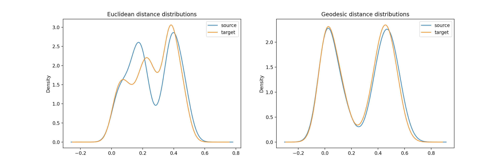

### Usage
1. install pybind11 by
    ```sh
    $ pip install pybind11
    ```
2. build 
    ```sh
    $ python setup.py build_ext -i
    ```
3. run test on 4d point cloud
    ```sh
    $ python test_with_steve.py
    Percentage of the Point Cloud to calculate: 0.25 # 3/4 of the whole point cloud will be discarded (by taking a patch, not sampling)
    Voxel Size: 0.03
    Sample_rate for Visualization: 0.1 # kde plot 
    ```
    
4. how to use in a python script
    ```python
    from vgd import np_num_voxel_geo_dist
    from vgd import np_voxel_size_geo_dist

    dist_mat = np_num_voxel_geo_dist(point_cloud, 80) # number of voxels for the longest edge of the bounding box 
    dist_mat = np_voxel_size_geo_dist(point_cloud, 0.01) # voxel_size of 0.01
    ```


### Reuse the wrapper for diffusion distance
* take a look at [`voxel_geodesic_distance.cpp`](./voxel_geodesic_distance.cpp)
* the definition of voxel geo distance calculation is like:
    ```cpp
    void voxel_geo_distance(double* points, double* nodes, int N, int M, double* dist_mat, double size_of_voxel, int n_voxels)
    ```
* so diffusion distance should probably looks like:
    ```cpp
    void voxel_geo_distance(double* points, double* nodes, int N, int M, double* dist_mat)
    ```
    * `points` and `nodes` are set of points as pointers (so we don't need to copy from numpy), and `N` and `M` are their sizes.
    * `dist_mat` is currently expecting size of `N*N` 


### TODO
Deal with nodes not points
#### Bug Fixed
eccentricity and centricity needs to calculate max, so it is affected by the INF distances. Now they are set to be 0 if is bigger than the longest posible distance between two points in a cube (3 times number of voxels)
```cpp
...
for (size_t i=0; i<dijk_info.size(); i++) 
    if (dijk_info[i] >= 600) // assuming at most 200^3 voxels, and no crazy spiral surface
        dijk_info[i] = 0.0;
...
```
